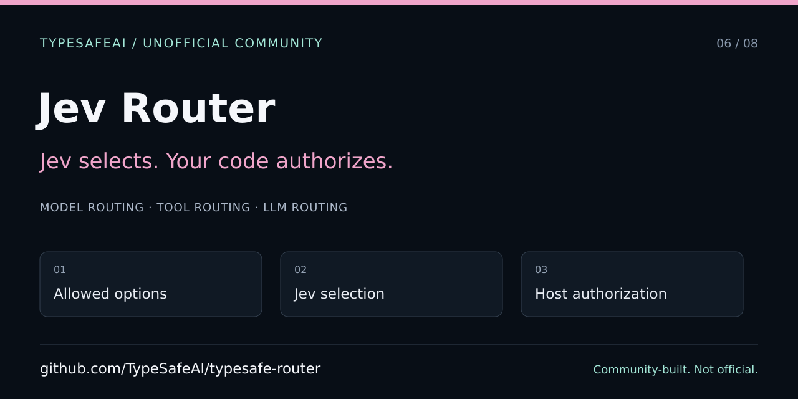

# Jev Router — developer and agent entry point

> Unofficial TypeSafeAI community project, not the official TypeSafe AI SDK or a production authorization system. The community organization was created by VC Moderator [@BunsDev](https://github.com/BunsDev).



[Full API and behavior reference](../../README.md) · [Agent instructions](../../AGENTS.md) · [Contributing](../../CONTRIBUTING.md)

## Current repository and setup

The canonical community source is [TypeSafeAI/typesafe-router](https://github.com/TypeSafeAI/typesafe-router). Older BunsDev links in historical documentation refer to the transferred project, not a separate current authority.

```sh
git clone https://github.com/TypeSafeAI/typesafe-router.git
cd typesafe-router
npm ci
npm run dev
```

Use npm and `package-lock.json`; do not introduce another package manager or lockfile. Follow the checked-in Next.js requirements. Without a configured key, the lab uses a labeled local mock. Provider calls are explicit; tests must not consume shared API credits. This is source in a private package, not an assumed public npm installation.

## Architecture and boundaries

| Path | Responsibility |
| --- | --- |
| `lib/jevRouter.ts` | Validation, closed-set selection, fallback policy and result logging |
| `lib/jevClient.ts` | Jev wire format and provider errors |
| `lib/routerConfigs.ts` | Model/tool options and mandatory fallback choices |
| `lib/mockRouter.ts` | Keyword-based local demonstration |
| `types/router.ts`, `lib/index.ts` | Types and public source exports |
| `app/api/route/route.ts` | Same-origin provider boundary and credential handling |
| `components/RouterLab.tsx` | Interactive lab and state |
| `app/opengraph-image.tsx` | Public editorial PNG; no user input or provider calls |

Jev selects; the application independently authorizes and executes. Preserve unique IDs, the allowed option set, required defaults, null clarification routes, no-tool outcomes, and provider-error propagation. The `safe_default` policy name is not proof that a downstream action is harmless. Do not turn failed live calls into successful mock outcomes.

Browser keys and lab state have separate storage. LocalStorage is not an encrypted vault, and input/history exports may contain private text even when the key is omitted. Keep credentials out of URLs, metadata, images, logs and fixtures. Preserve rate limits, payload bounds and trusted-proxy behavior.

## Verification

```sh
npm test
npm run typecheck
npm run lint
npm run build
npm run e2e
node --test scripts/social-metadata.test.mjs
```

The existing browser suite builds and serves the no-key demo. The sharing test fetches rendered metadata and validates PNG signature/dimensions against that build. The standalone source check is narrower and is not deployment evidence. Preserve all existing policy, persistence and API tests.

## Share accurately

Website metadata uses the repository's configured public homepage, `https://route.jev.works`, and a 1200×630 generated PNG. Verify actual rendered tags and image responses after deployment; a merged source change is not proof that production is serving it. No root canonical forces future routes to the homepage.

The SVG in this guide is separate 1280×640 repository artwork, not a product screenshot. Follow the [shared publishing checklist](https://github.com/TypeSafeAI/.github/blob/main/docs/discovery/SHARING.md). The committed About/topics manifest does not apply GitHub settings or upload a Social preview.

Use clean, no-key browser state and synthetic inputs for screenshots. Record the source commit, route, viewport, theme and environment; keep demo/fallback labels visible. The sharing test captures an actual browse-only lab without submitting a routing request. Follow the [evidence protocol](https://github.com/TypeSafeAI/.github/blob/main/docs/discovery/SCREENSHOTS.md) and do not advertise tool execution, calibrated correctness, or production safety that this project does not establish.
